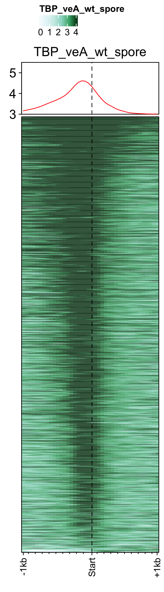
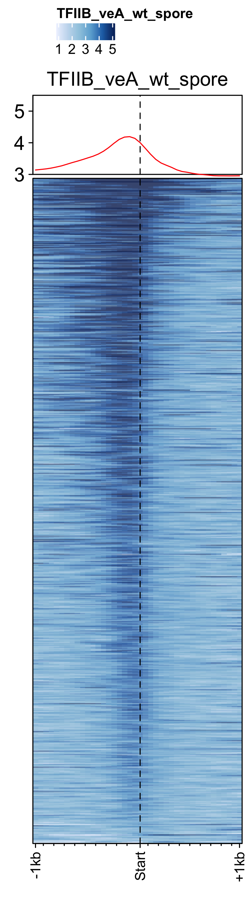
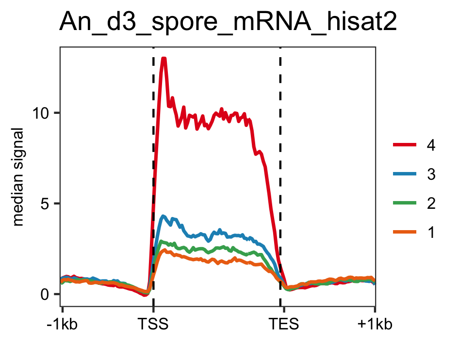
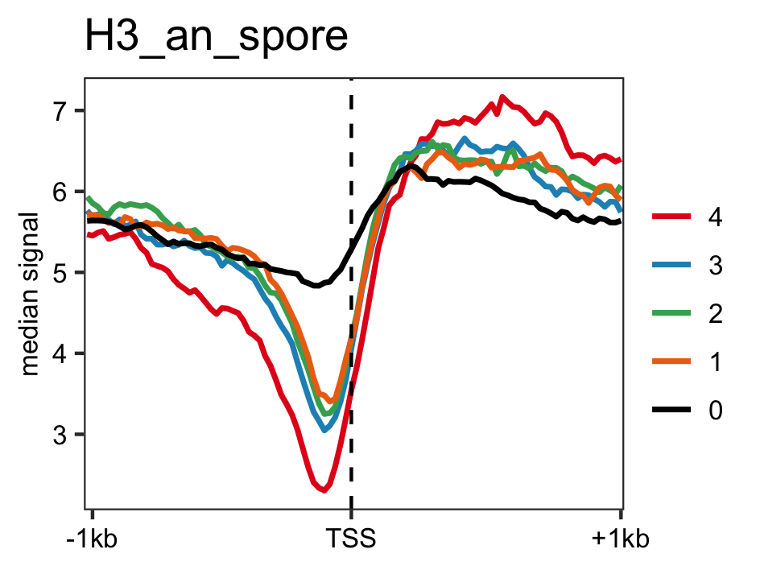

<!-- README.md is generated from README.Rmd. Please edit that file -->
FungalSporeAnalysis
===================

Load feature file and data (bw files stored as GRanges object).

``` r
devtools::load_all()
gene_list <- readr::read_delim("data/An_Spore_Pol2.txt", delim="\t", col_names = FALSE)
feature_gr <- AnnotationDbi::loadDb("R/an_feature_file_s10_m04_r07.sqlite")
```

Profiles of pre-initiation complex factors ie. RNAP-II, TBP and TFII-B in spores of *A. nidulans* generated using `genelist_specific_profileplot` function.

``` r
# RNAP-II 
genelist_specific_profileplot(feature_gr=feature_gr,bw_files = "pol2_veA_wt_spore", genelist=gene_list, output_name="An_Spore_Pol2", ymin=3,max_key = 10, min_key = 0, ymax = 5.5, palette = "white_red")

# TBP
genelist_specific_profileplot(feature_gr=feature_gr,bw_files = "TBP_veA_wt_spore", genelist=gene_list,max_key=4.5,min_key = 0, output_name="An_Spore_TBP", ymin=3, palette = "white_green", ymax = 5.5)

# TFII-B
genelist_specific_profileplot(feature_gr=feature_gr,bw_files = "TFIIB_veA_wt_spore", genelist=gene_list,max_key=5,min_key = 1, output_name="An_Spore_TFIIB", ymin=3, palette = "white_blue", ymax = 5.5)
```


<p class="caption">
</p>

Load list of genes to be subsetted from feature file, containing RNAP-II expression values.

``` r
genelist <- readr::read_delim("data/an_spore_pol2_for_percentilelineplot.txt",delim="\t", col_names=FALSE)
```

Distribution of actively transcrbing genes ranked by RNAP-II values in data RNAP-II and RNASeq data.

``` r
# RNAP-II
lineplot_for_bw(feature_txDb, genelist =genelist,bw_file="pol2_veA_wt_spore", output_name = "plots/pol2_veA_wt_spore")

# mRNA levels
lineplot_for_bw(feature_txDb, genelist=genelist, bw_file="An_d3_spore_mRNA_hisat2", output_name = "plots/An_d3_spore_mRNA_hisat2", tss=FALSE)
```

Distribution of actively transcrbing genes ranked by RNAP-II values and control genes in H3 data.

``` r
lineplot_for_bw(feature_txDb, genelist =genelist,bw_file="H3_an_spore", output_name = "plots/H3_an_spore", expression_value = FALSE)
```


<p class="caption">
</p>
