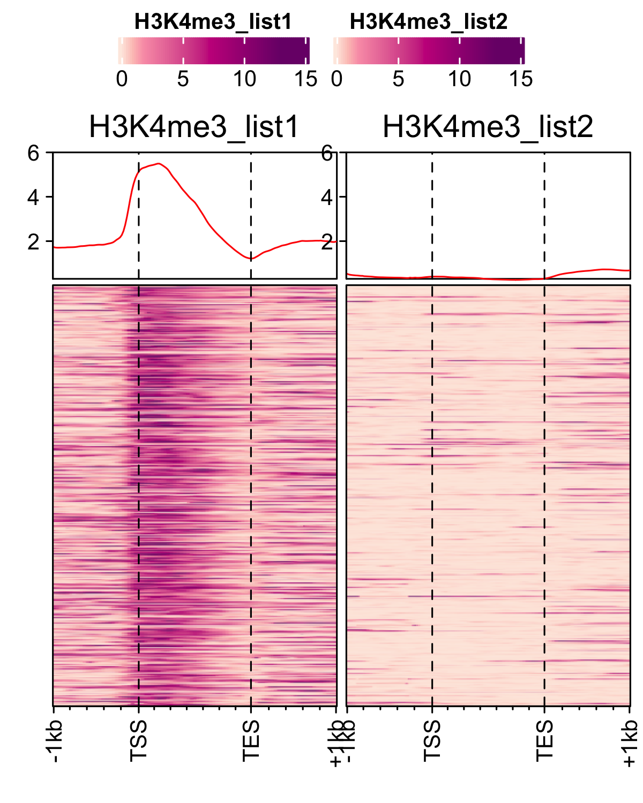
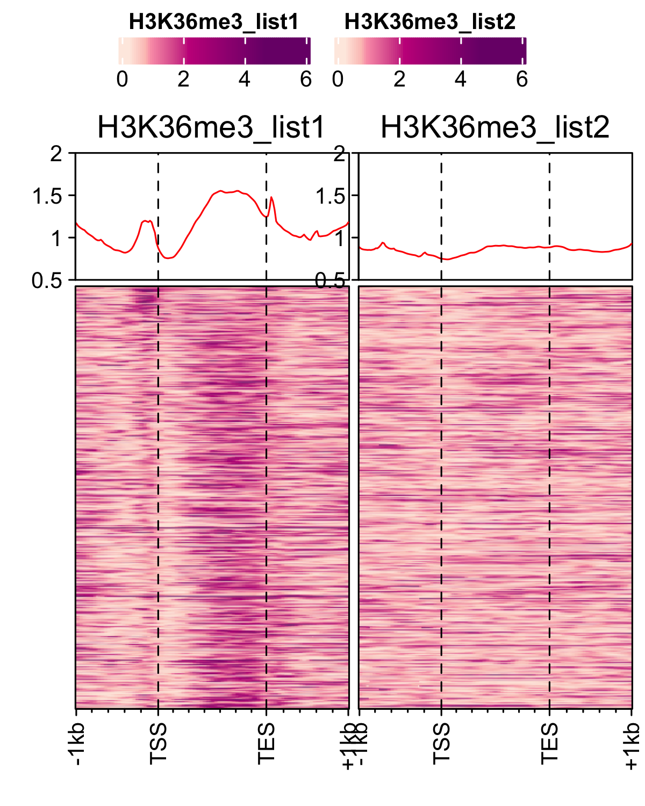

<!-- README.md is generated from README.Rmd. Please edit that file -->
FungalSporeAnalysis
===================

Load feature file and data (bw files stored as GRanges object).

``` r
devtools::load_all()
gene_list <- readr::read_delim("data/an_spore_pol2.txt", delim="\t", col_names = FALSE)
feature_txDb <- AnnotationDbi::loadDb("R/an_feature_file_s10_m04_r07.sqlite")
```

Profiles of pre-initiation complex factors ie. RNAP-II, TBP and TFII-B in spores of *A. nidulans* generated using `genelist_specific_profileplot` function.

``` r
# RNAP-II 
genelist_specific_profileplot(feature_txDb =feature_txDb,bw_files = "pol2_veA_wt_spore", genelist=gene_list, output_name="plots/An_Spore_Pol2", ymin=3,max_key = 10, min_key = 0, ymax = 5.5, palette = "white_red")

# TBP
genelist_specific_profileplot(feature_txDb =feature_txDb,bw_files = "TBP_veA_wt_spore", genelist=gene_list,max_key=4.5,min_key = 0, output_name="plots/An_Spore_TBP", ymin=3, palette = "white_green", ymax = 5.5)

# TFII-B
genelist_specific_profileplot(feature_txDb =feature_txDb,bw_files = "TFIIB_veA_wt_spore", genelist=gene_list,max_key=5,min_key = 1, output_name="plots/An_Spore_TFIIB", ymin=3, palette = "white_blue", ymax = 5.5)
```


<p class="caption">
</p>

Load list of genes to be subsetted from feature file, containing RNAP-II expression values.

``` r
genelist <- readr::read_delim("data/an_spore_pol2_for_percentilelineplot.txt",delim="\t", col_names=FALSE)
```

Distribution of actively transcrbing genes ranked by RNAP-II values in data RNAP-II and RNASeq data.

``` r
# RNAP-II
lineplot_for_bw(feature_txDb, genelist =genelist,bw_file="pol2_veA_wt_spore", output_name = "plots/pol2_veA_wt_spore")

# mRNA levels
lineplot_for_bw(feature_txDb, genelist=genelist, bw_file="An_d3_spore_mRNA_hisat2", output_name = "plots/An_d3_spore_mRNA_hisat2", tss=FALSE)
```

Distribution of actively transcrbing genes ranked by RNAP-II values and control genes(non-transcribing genes) in H3 data.

``` r
# Histone H3 occupancy
genelist <- readr::read_delim("data/an_spore_pol2_for_H3percentile.txt",delim="\t", col_names=FALSE)

lineplot_for_bw(feature_txDb, genelist =genelist,bw_file="H3_an_spore", output_name = "plots/H3_an_spore", expression_value = FALSE)
```


<p class="caption">
</p>

Different histone mark's occupancy at actively transcribing genes in spore. Here, histone mark signals are normalized to H3. Plots are generated using `profiles_normalized_by_control` function. First, load RNAP-II signals to rank the histone marks and a genelist of control genes which are lowly transcribing or non-transcribing genes. And then generate normalized profiles of H3Ac, H3K4me3 and H3K36me3 marks.

``` r

genelist_1 <- readr::read_delim("data/an_spore_pol2.txt", delim="\t", col_names = FALSE)
genelist_2 <- readr::read_delim("data/an_spore_pol2_controlgenes.txt", delim="\t", col_names = FALSE)

# H3Ac occupancy
profiles_normalized_by_control(feature_txDb = feature_txDb,bw_test = "H3AC_veA_wt_spore", bw_control = "H3_an_spore",genelist_1 = genelist_1,genelist_2 = genelist_2, ymax = 3.8,ymin=0.5, output_name = "plots/H3Ac_veA_wt_spore")

# H3K4me3
profiles_normalized_by_control(feature_txDb = feature_txDb,bw_test = "H3K4me3_veA_wt_spore", bw_control = "H3_an_spore",genelist_1 = genelist_1,genelist_2 = genelist_2, ymax = 6,ymin=0.3, output_name = "plots/H3K4me3_veA_wt_spore")

# H3K36me3
profiles_normalized_by_control(feature_txDb = feature_txDb,bw_test = "H3K36me3_veA_wt_spore", bw_control = "H3_an_spore",genelist_1 = genelist_1,genelist_2 = genelist_2, ymax = 2,ymin=0.5, output_name = "plots/H3K36me3_veA_wt_spore")
```


<p class="caption">
</p>
