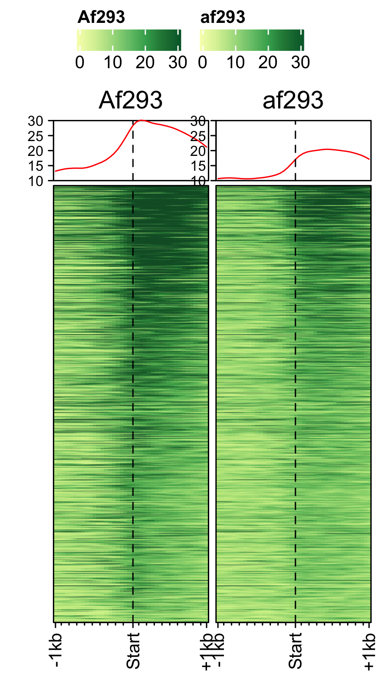

---
output:
     html_document:
          theme: united
          highlight: tango
          toc: TRUE
          toc_float: TRUE
          toc_collapsed: FALSE
          smooth_scroll: TRUE
          toc_depth: 4
          number_sections: FALSE
---

```{r setup, include=FALSE}
knitr::opts_chunk$set(echo = TRUE)
```

# Fungal spore data analysis

*__Koon Ho Wong's lab, University of Macau__*

## **Transcription in spores**

### Profiles of pre-initiation complex (PIC) factors 

Load feature file and data (bw files stored as GRanges object).
```{r,warning=FALSE, echo=TRUE, eval=FALSE}
devtools::load_all()
gene_list <- readr::read_delim("data/an_spore_pol2.txt", delim="\t", col_names = FALSE)
feature_txDb <- AnnotationDbi::loadDb("R/an_feature_file_s10_m04_r07.sqlite")
```

PIC profiles ie. RNAP-II, TBP and TFII-B in spores of *A. nidulans* generated using  `genelist_specific_profileplot` function.
```{r,warning=FALSE, echo=TRUE, eval=FALSE}
# RNAP-II 
genelist_specific_profileplot(feature_txDb =feature_txDb,bw_files = "pol2_veA_wt_spore", genelist=gene_list, output_name="plots/An_Spore_Pol2", ymin=3,max_key = 10, min_key = 0, ymax = 5.5, palette = "white_red")

# TBP
genelist_specific_profileplot(feature_txDb =feature_txDb,bw_files = "veA_wt_TBP_spore", genelist=gene_list,max_key=4.5,min_key = 0, output_name="plots/An_Spore_TBP", ymin=3, palette = "white_green", ymax = 5.5)

# TFII-B
genelist_specific_profileplot(feature_txDb =feature_txDb,bw_files = "TFIIB_veA_wt_spore", genelist=gene_list,max_key=5,min_key = 1, output_name="plots/An_Spore_TFIIB", ymin=3, palette = "white_blue", ymax = 5.5)

```

```{r, echo=FALSE,out.width="32%",out.height="650px",fig.cap=" ",fig.show='hold',fig.align='center'}
knitr::include_graphics(c("plots/An_Spore_Pol2_1030_hm.png","plots/An_Spore_TBP_1030_hm.png","plots/An_Spore_TFIIB_1030_hm.png"))
``` 

### Percentile rank of RNAP-II, mRNA-levels and H3
Distribution of actively transcrbing genes ranked by RNAP-II values in data RNAP-II and RNASeq data.

```{r,warning=FALSE, echo=TRUE, eval=FALSE}
genelist <- readr::read_delim("data/an_spore_pol2_for_percentilelineplot.txt",delim="\t", col_names=FALSE)

# RNAP-II
lineplot_for_bw(feature_txDb, genelist =genelist,bw_file="pol2_veA_wt_spore", output_name = "plots/pol2_veA_wt_spore")

# mRNA levels
lineplot_for_bw(feature_txDb, genelist=genelist, bw_file="An_d3_spore_mRNA_hisat2", output_name = "plots/An_d3_spore_mRNA_hisat2", tss=FALSE)
```

Distribution of actively transcrbing genes ranked by RNAP-II values and control genes(non-transcribing genes) in H3 data.
```{r,warning=FALSE, echo=TRUE, eval=FALSE}
# Histone H3 occupancy
genelist <- readr::read_delim("data/an_spore_pol2_for_H3percentile.txt",delim="\t", col_names=FALSE)

lineplot_for_bw(feature_txDb, genelist =genelist,bw_file="H3_an_spore", output_name = "plots/H3_an_spore", expression_value = FALSE)
```
```{r, echo=FALSE,out.width="32%",out.height="15%",fig.cap=" ",fig.show='hold',fig.align='center'}
knitr::include_graphics(c("plots/pol2_veA_wt_spore_lineplot.png","plots/An_d3_spore_mRNA_hisat2_lineplot.png","plots/H3_an_spore_lineplot.png"))
```

### Histone occupancy
Different histone mark's occupancy at actively transcribing genes in spore. Here, histone mark signals are normalized to H3. Plots are generated using `profiles_normalized_by_control` function. First, load RNAP-II signals to rank the histone marks and a genelist of control genes which are lowly transcribing or non-transcribing genes. And then generate normalized profiles of H3Ac, H3K4me3 and H3K36me3 marks. 
```{r,warning=FALSE, echo=TRUE, eval=FALSE}

genelist_1 <- readr::read_delim("data/an_spore_pol2.txt", delim="\t", col_names = FALSE)
genelist_2 <- readr::read_delim("data/an_spore_pol2_controlgenes.txt", delim="\t", col_names = FALSE)

# H3Ac occupancy
profiles_normalized_by_control(feature_txDb = feature_txDb,bw_test = "H3AC_veA_wt_spore", bw_control = "H3_an_spore",genelist_1 = genelist_1,genelist_2 = genelist_2, ymax = 3.8,ymin=0.5, output_name = "plots/H3Ac_veA_wt_spore")

# H3K4me3
profiles_normalized_by_control(feature_txDb = feature_txDb,bw_test = "H3K4me3_veA_wt_spore", bw_control = "H3_an_spore",genelist_1 = genelist_1,genelist_2 = genelist_2, ymax = 6,ymin=0.3, output_name = "plots/H3K4me3_veA_wt_spore")

# H3K36me3
profiles_normalized_by_control(feature_txDb = feature_txDb,bw_test = "H3K36me3_veA_wt_spore", bw_control = "H3_an_spore",genelist_1 = genelist_1,genelist_2 = genelist_2, ymax = 2,ymin=0.5, output_name = "plots/H3K36me3_veA_wt_spore")
```
```{r, echo=FALSE,out.width="32%",out.height="10%",fig.cap=" ",fig.show='hold',fig.align='center'}
knitr::include_graphics(c("plots/H3Ac_veA_wt_spore_2_normalized_hm.png","plots/H3K4me3_veA_wt_spore_2_normalized_hm.png","plots/H3K36me3_veA_wt_spore_2_normalized_hm.png"))
``` 

### Initiation and RNAP-III factors

```{r,warning=FALSE, echo=TRUE, eval=FALSE}
# tRNA feature file
feature_txDb <- AnnotationDbi::loadDb("R/an_feature_file_s10_m04_r07_tRNA.sqlite")
# tRNA signal file 
gene_list <- readr::read_delim("data/an_spore_tRNA.txt", delim="\t", col_names = FALSE)

# TFIII-B
genelist_specific_profileplot(feature_txDb = feature_txDb, genelist = gene_list, bw_files = "AN3116_HA_spore",ymax = 280, ymin = 10, max_key = 59, min_key = 0, output_name = "plots/AN3116_HA_spore", log2 = FALSE, palette = "cream_green")

# TBP
genelist_specific_profileplot(feature_txDb = feature_txDb, genelist = gene_list, bw_files = "veA_wt_TBP_spore",ymax = 46, ymin = 8, max_key = 59, min_key = 0, output_name = "plots/TBP_veA_wt_spore_tRNA", log2 = FALSE, palette = "cream_green")

# TFIII-C
genelist_specific_profileplot(feature_txDb = feature_txDb, genelist = gene_list, bw_files = "AN7997_HA_spore",ymax = 26, ymin = 8, max_key = 59, min_key = 0, output_name = "plots/AN7997_HA_spore", log2 = FALSE, palette = "cream_green")

# Rpo31
genelist_specific_profileplot(feature_txDb = feature_txDb, genelist = gene_list, bw_files = "AN10316_HA_spore",ymax = 270, ymin = 10, max_key = 150, min_key = 0, output_name = "plots/AN10316_HA_spore", log2 = FALSE, palette = "cream_brown")

# Rpc40
genelist_specific_profileplot(feature_txDb = feature_txDb, genelist = gene_list, bw_files = "AN2415_HA_spore",ymax = 180, ymin = 10, max_key = 150, min_key = 0, output_name = "plots/AN2415_HA_spore", log2 = FALSE, palette = "cream_brown")

# Rpc11
genelist_specific_profileplot(feature_txDb = feature_txDb, genelist = gene_list, bw_files = "AN4219_myc_spore",ymax = 225, ymin = 10, max_key = 150, min_key = 0, output_name = "plots/AN4219_myc_spore", log2 = FALSE, palette = "cream_brown")

```
```{r, echo=FALSE,out.width="15%",out.height="10%",fig.cap=" ",fig.show='hold',fig.align='center'}
knitr::include_graphics(c("plots/AN3116_HA_spore_180_hm.png","plots/TBP_veA_wt_spore_tRNA_180_hm.png","plots/AN7997_HA_spore_180_hm.png", "plots/AN10316_HA_spore_180_hm.png","plots/AN2415_HA_spore_180_hm.png","plots/AN4219_myc_spore_180_hm.png" ))
```

### 5S-rDNA
```{r,warning=FALSE, echo=TRUE, eval=FALSE}
# tRNA feature file
feature_txDb <- AnnotationDbi::loadDb("R/aniger_feature_file_s01_m07_r09_5SrDNA.sqlite")

# tRNA signal file 
gene_list <- readr::read_delim("data/an_spore_5SrDNA.txt", delim="\t", col_names = FALSE)

# Initiation factors
bw_files <- c("AN3116_HA_spore_niger","veA_wt_TBP_spore_niger", "AN7997_HA_spore_niger")

genelist_specific_profileplot(feature_txDb = feature_txDb, genelist = gene_list, bw_files = bw_files,ymax = 2200, ymin = 0, max_key = 1050, min_key = 0, output_name = "plots/an_spore_initiationfactor_5SrDNA", log2 = FALSE, palette = "cream_green", rename = TRUE)

# RNAP-III subunits
bw_files=c("AN10316_HA_spore_niger", "AN2415_HA_spore_niger", "AN4219_myc_spore_niger")

genelist_specific_profileplot(feature_txDb = feature_txDb, genelist = gene_list, bw_files = bw_files,ymax = 2500, ymin = 0, max_key = 1050, min_key = 0, output_name = "plots/an_spore_pol3_5SrDNA", log2 = FALSE, palette = "cream_brown", rename = TRUE)
```
```{r, echo=FALSE,out.width="49%",out.height="10%",fig.cap=" ",fig.show='hold',fig.align='center'}
knitr::include_graphics(c("plots/an_spore_initiationfactor_5SrDNA_52_hm.png","plots/an_spore_pol3_5SrDNA_52_hm.png"))
```

## **Transcription in other fungal spores.**

### *A. nidualans*, *A. fumigatus* and *P. marneffei* spores.
```{r,warning=FALSE, echo=TRUE, eval=FALSE}

# A. nidulans 
feature_txDb <- AnnotationDbi::loadDb("R/an_feature_file_s10_m04_r07.sqlite")
bw_files <- c("pol2_veA_wt_spore", "input_an_3dspore_polII")

genelist_specific_profileplot(feature_txDb = feature_txDb, genelist = NULL, bw_files = bw_files,top_line = FALSE, max_key = 59, min_key = 0, output_name = "plots/an_pol2_input", log2 = FALSE, palette = "cream_brown", rename = TRUE)

# A. fumigatus
feature_txDb <- AnnotationDbi::loadDb("R/af_feature_file_s03_m05_r07.sqlite")
bw_files <- c("Af293_spore_2d_polii", "input_af_3dspore_polII")

genelist_specific_profileplot(feature_txDb = feature_txDb, genelist = NULL, bw_files = bw_files,top_line = FALSE, max_key = 30, min_key = 0, output_name = "plots/af_pol2_input", log2 = FALSE, palette = "cream_green", rename = TRUE)

# P. marneffei
feature_txDb <- AnnotationDbi::loadDb("R/pm_feature_file_fungiDb41.sqlite")
bw_files <- c("pm_3day_spore_pol2", "input_pm_21dspore_polII")

genelist_specific_profileplot(feature_txDb = feature_txDb, genelist = NULL, bw_files = bw_files,top_line = FALSE, max_key = 30, min_key = 0, output_name = "plots/pm_pol2_input", log2 = FALSE, palette = "cream_pink", rename = TRUE)

```
```{r, echo=FALSE,out.width="32%",out.height="10%",fig.cap=" ",fig.show='hold',fig.align='center'}
knitr::include_graphics(c("plots/an_pol2_input_10988_hm.png","plots/af_pol2_input_10130_hm.png","plots/pm_pol2_input_10194_hm.png"))
```

### Spores specific genes expression.
```{r,warning=FALSE, echo=TRUE, eval=FALSE}
dat <- readr::read_delim("data/an_spore_hypha_specificgenes.txt", delim="\t", col_names = TRUE)
input_data <- dat %>% dplyr::filter(class=="spore_maturation")

ggplot_heatmap(input_data ,threshold = TRUE, output_name = "plots/An_spores_maturation_genes_exprsn")
```
```{r,echo=FALSE,out.width="32%",out.height="10%",fig.cap=" ",fig.show='hold',fig.align='center'}
knitr::include_graphics(c("plots/An_CET_genes_exprsn ggplot_hm.png", "plots/An_trehalose_genes_exprsn ggplot_hm.png", "plots/An_spores_maturation_genes_exprsn ggplot_hm.png", "plots/An_conidiation_genes_exprsn ggplot_hm.png", "plots/An_septin_genes_exprsn ggplot_hm.png", "plots/An_tubulin_genes_exprsn ggplot_hm.png"))
```

### Functional analysis of spores in three fungi.

GO enrichment of actively transcribing genes of *A. nidulans*, *A. fumigatus* and *P. marneffei*.
```{r,warning=FALSE, echo=TRUE, eval=FALSE}
data <- readr::read_delim("data/an_af_pm_spores_GO.txt", col_names = TRUE, delim="\t")
GO_diamondplot(data, output_name = "plots/An_Af_Pm_GO", palette="three_color")
```
```{r, echo=FALSE,out.width = "450px",out.height="10%",fig.align='center'}
knitr::include_graphics(c("plots/An_Af_Pm_GOGoByColorPvalue.png"))
```

GO enrichment of actievly transcribing genes in *A. nidulans* spores under temperature, salt and Zn- stress.
```{r,warning=FALSE, echo=TRUE, eval=FALSE}
data <- readr::read_delim("data/an_spore_stress_GO.txt", col_names = TRUE, delim="\t")
data_subset <- data %>% dplyr::filter(class=="4C"|class=="42C")

GO_diamondplot(data=data_subset, output_name = "plots/An_spore_temperature", palette="two_color")
```
```{r,echo=FALSE,out.width="48%",out.height="10%",fig.cap=" ",fig.show='hold',fig.align='center'}
knitr::include_graphics(c("plots/An_spore_temperatureGoByColorPvalue.png", "plots/An_spore_ZnGoByColorPvalue.png", "plots/An_spore_NaClGoByColorPvalue.png", "plots/An_spore_kclGoByColorPvalue.png"))
```

GO enrichment of actievly transcribing genes in *A. fumigatus* spores under salt and Zn- stress.
```{r,warning=FALSE, echo=TRUE, eval=FALSE}
data <- readr::read_delim("data/af_spore_stress_GO.txt", col_names = TRUE, delim="\t")
data_subset <- data %>% dplyr::filter(class=="Zn")

GO_diamondplot(data=data_subset, output_name = "plots/Af_spore_Zn", palette="two_color")
```
```{r,echo=FALSE,out.width="32%",out.height="10%",fig.cap=" ",fig.show='hold',fig.align='center'}
knitr::include_graphics(c("plots/Af_spore_ZnGoByColorPvalue.png", "plots/Af_spore_NaClGoByColorPvalue.png", "plots/Af_spore_kclGoByColorPvalue.png"))
```

## **Time-course of spores**

### RNAP-II time-course (3-day, 6-day, 17-day) *A. nidulans* spores. 

```{r,warning=FALSE, echo=TRUE, eval=FALSE}

feature_txDb <- AnnotationDbi::loadDb("R/an_feature_file_s10_m04_r07.sqlite")
bw_files <- c("pol2_veA_wt_spore","6day_pol2_spore", "17day_pol2_spore")
gene_list <- readr::read_delim("data/an_spore_pol2.txt", delim="\t", col_names = FALSE)


genelist_specific_profileplot(feature_txDb = feature_txDb, genelist = gene_list, bw_files = bw_files,ymax = 62, ymin = 10, max_key = 60, min_key = 0, output_name = "plots/an_pol2_3d_6d_17d", log2 = FALSE, palette = "cream_brown", rename = TRUE)
```
```{r, echo=FALSE,out.width = "450px",out.height="10%",fig.align='center'}
knitr::include_graphics(c("plots/an_pol2_3d_6d_17d_1030_hm.png"))
```

### RNAP-II time-course (3-day, 17-day) of *A. fumigatus* spores. 
```{r,warning=FALSE, echo=TRUE, eval=FALSE}
feature_txDb <- AnnotationDbi::loadDb("R/af_feature_file_s03_m05_r07.sqlite")
gene_list <- readr::read_delim("data/af_spore_pol2.txt", delim="\t", col_names = FALSE)

# plot1: 3-day, plot2: 17-day
bw_files <- c("Af293_spore_2d_polii", "af293_spore_17d_polii")

genelist_specific_profileplot(feature_txDb = feature_txDb, genelist = gene_list, bw_files = bw_files,ymax=30,ymin=10, max_key = 30, min_key = 0, output_name = "plots/af_3day_17day_spore_pol2", log2 = FALSE, palette = "cream_green", rename = TRUE)
```
```{r,echo=FALSE, out.width = "300px",fig.align='center'}

```


